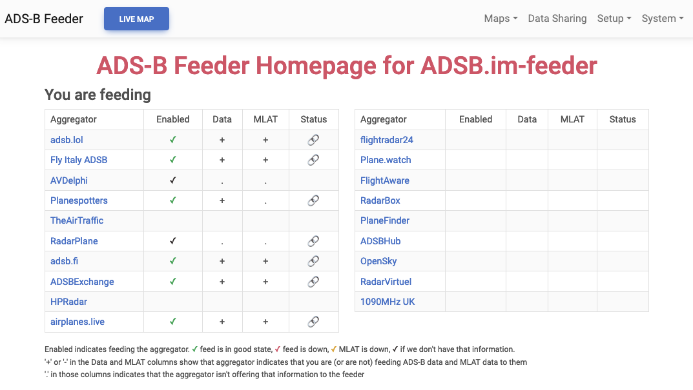

# ADS-B / SDR Feeder Image

<a href="https://adsb.im/home"></a>

[Introduction Videos](https://www.youtube.com/@adsb)

## The easiest way to track nearby aircraft, ships, and weather balloons with your own hardware and share with others

Track aircraft around you broadcasting ADS-B messages on 1090 MHz (and, in the US, UAT messages on 978 MHz). Show the planes on a map, including recent tracks, altitude, speed, and in case of many commercial flights even the route that they are on. For some reason some of the commercial vendors call this 'aircraft radar', even though radar is definitely not involved - it's all UHF radio waves. Similarly, track the data messages sent out by these planes via ACARS, VDL2, and HFDL - and track ships sending AIS and weather balloons using the RadioSonde data.

This project provides an easy to use turn-key SD card image for a number of single board computers (or to run in an x86 VM).
Currently we are building the following images:

- Raspberry Pi Raspian based, supports Zero 2, 3a/b, 4, and 5 (frequently tested on Zero 2W, 3a, 3b, and 4 - note that Pi Zero W will NOT work)
- Raspberry Pi DietPi based, supports Zero 2, 3a/b, and 4 (tested on 3b and 4 - note that Pi Zero W will NOT work)
- Raspberry Pi 5, DietPi based (tested)
- Libre Computing Le Potato (tested)
- Orange Pi Zero 3, 3LTS, and 5plus (Zero 3 regularly tested)
- NanoPi NEO3
- Odroid C4 and xu4

- VM setup under VirtualBox (easy), VMware (almost as easy), Hyper-V (a little more complicated), or Proxmox (advanced users) -- note that when running in VMs, there are known issues that are outside of the control of the image with USB timing that frequently lead to MLAT issues.
- x86 ISO for setup both as VM or natively on an x86_64 thin client or similar system

This setup can work on many other systems - if there is enough demand, we can easily add more boards (as long as they have reasonably well supported versions of ideally DietPi or also Armbian available).
Additionally, this software stack (with some differences in the user experience) can be installed on any DietPi board and even on most generic Linux systems running a Debian based distribution.

The idea is to create a "complete" ADS-B / SDR feeder that feeds pretty much all of the ADS-B flight trackers / aggregators (as well as ACARS, AIS, and Sonde aggreagators).

These ADS-B aggregators have a comittment to open data ([daily release of the data](https://github.com/adsblol/globe_history)); they also share with each other the data fed to them (in order to improve mlat coverage, it still makes sense to feed all of them):
- [adsb.lol](https://adsb.lol)
- [Fly Italy Adsb](https://flyitalyadsb.com)
- [TheAirTraffic](http://theairtraffic.com)

These ADS-B aggregators are also supported:
- [adsb.fi](https://adsb.fi)
- [ADS-B Exchange](https://adsbexchange.com)
- [ADSBHub](https://adsbhub.org)
- [sdrmap](https://sdrmap.org/)
- [airplanes.live](https://airplanes.live)
- [AVDelphi](https://www.avdelphi.com)
- [FlightAware](https://flightaware.com)
- [Flightradar24](https://www.flightradar24.com)
- [hpradar](https://skylink.hpradar.com/)
- [OpenSky Network](https://opensky-network.org)
- [Plane.watch](https://plane.watch)
- [Plane Finder](https://planefinder.net)
- [Planespotters.net](http://planespotters.net)
- [AirNav Radar](https://www.airnavradar.com)
- [Radar Virtuel](https://www.radarvirtuel.com)

For ACARS / VDL2 / HFDL the image currently supports
- [airframes.io](https://airframes.io)
- [ACARS Drama](https://acarsdrama.com/)
- [adsb.lol](https://www.adsb.lol/docs/open-data/aircraft-data-links/)
- [AVDelphi](https://avdelphi.com/)

For AIS, the image currently supports these community aggregators
- [airframes.io](https://airframes.io)
- [AIS Catcher](https://aiscatcher.org/)
- [AIS Friends](https://aisfriends.com/)
- [AISHub](https://www.aishub.net/)
- [HPRadar](https://sea.hpradar.com/)
- [sdrmap](https://sdrmap.org/)

As well as a number of commercial AIS aggregators
- [MarineTraffic](https://www.marinetraffic.com/)
- [MyShipTracking](https://www.myshiptracking.com/)
- [shipfinder](https://shipfinder.co/about)
- [ShippingExplorer](https://www.shippingexplorer.net/)
- [ShipXplorer](https://www.shipxplorer.com/)
- [VesselFinder](https://stations.vesselfinder.com/)

### Home page of an installed ADS-B Feeder Image



### The goal of this project is to make things as simple as possible for the non-technical user.

## Feed from a Single Board Computer (like the Raspberry Pi)

- buy one of the supported boards (Raspberry Pi 4b is by far the most commonly used one, the Orange Pi Zero 3 has a great price/value)
- invest in a decent power supply - we strongly recommend against attempting to power these boards from a powered hub or a cheap 'charger' plug, not having a stable 5V power source tends to be the biggest cause of issues with these SBC
- get an SDR and antenna. There are many many choices. Availability may differ depending on where you are. But often a generic SDR and
an indoor or (much better) outdoor antenna is all you need. More detail on the [ADSB.im website](https://adsb.im/supported).
- download the current release from the [Release section](https://github.com/dirkhh/adsb-feeder-image/releases/latest)
- use a tool like the [Raspberry Pi Imager](https://github.com/raspberrypi/rpi-imager/releases) to write the image to a µSD card on your computer (if you are using a Raspberry Pi board, you can skip the previous download step as the ADS-B / SDR Feeder Image is available as an option as part of the Raspberry Pi Imager).
- the standard Raspbian based images for Raspberry Pis allow configuring WiFi during image write with the Pi Imager, but in most cases it is easier to simply use the Hotspot method to connect to the image after boot and then set up the WiFi from a web browser. Simply wait after the first boot until you see a WiFi network called `adsb-feeder-image` - mode details at the [adsb.im Hotspot page](https://adsb.im/hotspot)
- boot from the image
- wait a couple of minutes for the initial boot to complete (with the DietPi based images that can mean quite a while, sometimes up to 10+ minutes if your internet is slow), then connect to the [ADSB-PI Setup Page](http://adsb-feeder.local) -- this link _should_ work to find the freshly booted system on your local network - assuming you have a reasonably standard setup with mDNS enabled. If this fails. got to the [adsb.im redirector](http://my.adsb.im) - which should forward you to the right local address on your network. In the rare case where this fails as well you'll need to manually find the board's IP address - either using a connected keyboard / monitor, or via your router or other source of local IP addresses.
Please note: if you have more than one ADSB.im feeder on the same network, they will be assigned names like `adsb-feeder-2.local`, etc. So please pay attention which of the different systems you are connecting to in that case.
- on the setup website enter the latitude, longitude, and elevation of your receiver as well as a name.
- finally there's a quick selection of the 'account-less' aggregators to submit data to - the ones where you need accounts are on a separate config page -- or you can opt not to feed ADS-B at all if you are using the image for ACARS, AIS, etc
- click on Submit and then be patient while everything gets installed and setup - depending on your internet speed this could again take several minutes
- there are a few more pages to choose options for the live map, the SDR, a number of system administration topics, and finally to decide which aggregators to feed
- once the setup is completed, you'll be forwarded to your feeder home page from where you can go to all of the various pages that your feeder offers. Usually a good one to start with is the TAR1090 Map at the top. Or the ACARS Hub or AIS Catcher app if you enabled either of those features.

## Feed from an x86 virtual machine

As mentioned above, there are known issues with USB timing when accessing an SDR from within a VM - these are unrelated to the ADS-B Feeder image but instead based in the implementation details of most hypervisors. As a result, it is not uncommon to see MLAT issues with feeders running in a VM.

### for VirtualBox or VMware Workstation / Fusion

Download the `adsb-im-x86-64-vm-*.ova.xz` for the latest release. Double click on the OVA (which should open your virtualization software). Finish the import (under VMware you'll get a warning about a compatibility issue, simply clicking retry should get you past that). Before you start the VM, pass your SDR (which should be connected to a USB port of your PC or Mac) through to that VM. How this is done varries by product and the OS you are running on (Windows, macOS, Linux), but basically in all cases there is an option to pass a USB device to a VM - select your SDR in that list.

Now boot the image and wait a brief while until the console screen stops scrolling and shows a DietPi startup screen that below the two yellow lines presents you with an IP address. Connect to this IP address from your browser and you'll be able to set up the feeder and start sending data to the aggregators of your choice.


### for Hyper-V

Download the `adsb-im-x86-64-vm-*-Hyper-V-x86_64.vhdx.xz` for the latest release. Use File Explorer to extract the .vhdx file. In Hyper-V Manager, create a new virtual machine by selecting New->Virtual Machine... from the Action menu. In the following set of dialogs pick a name for the VM and then select Generation 1 (as the disk image assumes a standard BIOS-based VM, not a UEFI-based one. Otherwise proceed as normal, picking the desired amount of memory and the desired network connection. Then on the Connect Virtual Hard Disk page check the box for Use an existing virtual hard disk and browse to the location where the decompressed .vhdx file is located. Once that is completed, you can click Finish and start the VM. Wait a brief while until the console screen stops scrolling and shows a DietPi startup screen that below the two yellow lines presents you with an IP address. Connect to this IP address from your browser and you'll be able to set up the feeder and start sending data to the aggregators of your choice.

### for advanced users wanting to run this image on x86 under Proxmox

- connect to your Proxmox host web UI and log in
- select your host in the left pane, then in the center pane click on `>_ Shell` to open a web shell
- make a directory and cd there: `mkdir -p ~/adsbim; cd ~/adsbim`
- download the x86-64-vm Proxmox image (use the URL for the current version): `wget -O adsb-im-vm.tar.xz https://github.com/dirkhh/adsb-feeder-image/releases/download/v3.0.4/adsb-im-x86-64-vm-v3.0.4-proxmox.tar.xz`
- unpack the image and create a fresh VM: `tar xJf adsb-im-vm.tar.xz && bash ./pve-vmcreate.sh -s 16G -p local-lvm:0`
- optional: remove the download: `cd && rm -rf ~/adsbim`
- after this process completes, you should see the new VM in the Proxmox web UI
- start the VM, wait for the first boot to complete, and then connect to it's web interface as usual
- remember to pass through the SDR USB device to the VM before trying to configure the feeder


## Feed from most Linux systems

You can also install this software stack as an app on an existing Linux system. If you are running DietPi as the Linux OS on your system, you can simply install it using `dietpi-software` (it's app 141). Otherwise you can run a small [install script](https://raw.githubusercontent.com/dirkhh/adsb-feeder-image/main/src/tools/app-install.sh). For the trusting kinda people, all you need to do is
```
curl https://raw.githubusercontent.com/dirkhh/adsb-feeder-image/main/src/tools/app-install.sh | sudo bash
```
Or you could do the more sensible thing of downloading the script, reading it, and then executing it.

The UI can be accessed via port 1099.

Uninstall after having installed via the above script:
```
sudo bash /opt/adsb/app-uninstall
```

# for developers

This repo actually contains the scripting to create the SD card image for some common SBCs to run an ADS-B feeder. And as 'releases' it publishes such images.

This requires [CustomPiOS](https://github.com/guysoft/CustomPiOS) - unpack this next to the `CustomPiOS` folder in order for the scripts to work.

## python app

If you are looking for the sources to the adsb-setup app, they are at [src/modules/adsb-feeder/filesystem/root/opt/adsb/adsb-setup](https://github.com/dirkhh/adsb-feeder-image/tree/master/src/modules/adsb-feeder/filesystem/root/opt/adsb/adsb-setup)
